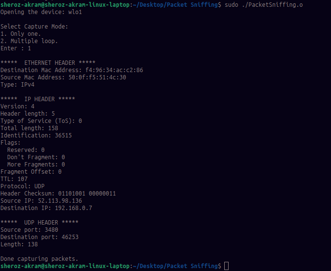

## Packet Sniffing

Packet sniffing is a method of detecting and assessing packet data sent over a network. It can be used by administrators for network monitoring and security. However, packet sniffing tools can also be used by hackers to spy or steal confidential data.

This repo has the basic code for catching packet which is written in C using pcap library. This program also display the content of packet which include Ethernet Header details such Destination and Source MAC addresses. Also display the IP Layer data including the Source and Destination Port and other main information such as Protocol used. Display TCP or UDP depending upon the protocol used.

<p style="color:red">This Program does not Support IPv6. Added in future updates.</p>

### Compiling the Program

``` gcc PacketSniffing.c -o PacketSniffing.o -lpcap ```

### Running

``` sudo ./PacketSniffing.o ```

## Screenshot

